# Kisan Saathi

**Multilingual WhatsApp AI for farmers: crop disease photo diagnosis, prices, weather, schemes**

Kisan Saathi is a farmer-first assistant that combines AI guidance with practical local insights.
It helps farmers with crop health decisions, market price visibility, weather awareness, and access to government schemes from a simple web + WhatsApp-friendly experience.

## Features

- Multilingual experience for farmer accessibility
- Crop disease support with photo upload and diagnosis workflow
- Mandi price lookup for key crops and regions
- Local weather snapshots and advisory context
- Government scheme discovery for relevant farming support
- Dashboard modules for alerts, notifications, and profile-based recommendations
- AI-powered nutrient and advisory guidance

## Tech Stack

- Vite
- React
- TypeScript
- React Router
- React Query
- Tailwind CSS + Radix UI components

## Getting Started

### Prerequisites

- Node.js 18+ (recommended)
- npm 9+

### Installation

```bash
git clone https://github.com/vishalgojha/kisan-saathi.git
cd kisan-saathi
npm install
```

### Environment Variables

Copy `env.example` to `.env` and update values:

```env
VITE_APP_ID=your_app_id
VITE_API_BASE_URL=http://localhost:3000
VITE_WHATSAPP_NUMBER=919876543210
VITE_UPLOAD_ENDPOINT=
VITE_DATA_MODE=mock
VITE_ALLOW_MOCK_FALLBACK=true
VITE_MONITORING_ENDPOINT=
VITE_MONITORING_API_KEY=
VITE_RELEASE_VERSION=
```

Runtime behavior:
- `VITE_DATA_MODE=mock`: always use mock adapters.
- `VITE_DATA_MODE=live`: use live adapters.
- In production, default mode is `live` if not specified.
- In production live mode, set `VITE_ALLOW_MOCK_FALLBACK=false` to fail fast.
- `VITE_MONITORING_ENDPOINT`: error export endpoint (required in production).

### Run Locally

```bash
npm run dev
```

Open: `http://localhost:5173`

### Type Check and Build

```bash
npm run typecheck
npm run build
npm run validate:env
```

### E2E Gate

```bash
npm run test:e2e
```

## Screenshots

Add screenshots to `docs/screenshots/` and update these links if filenames differ.

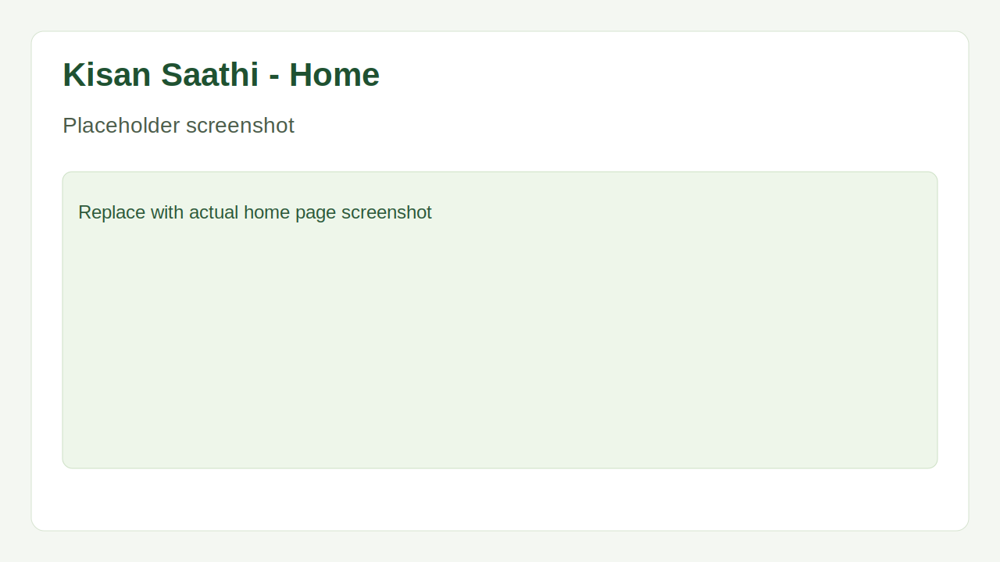
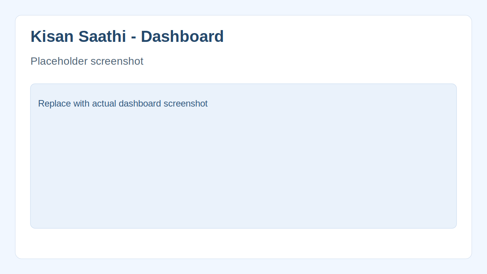
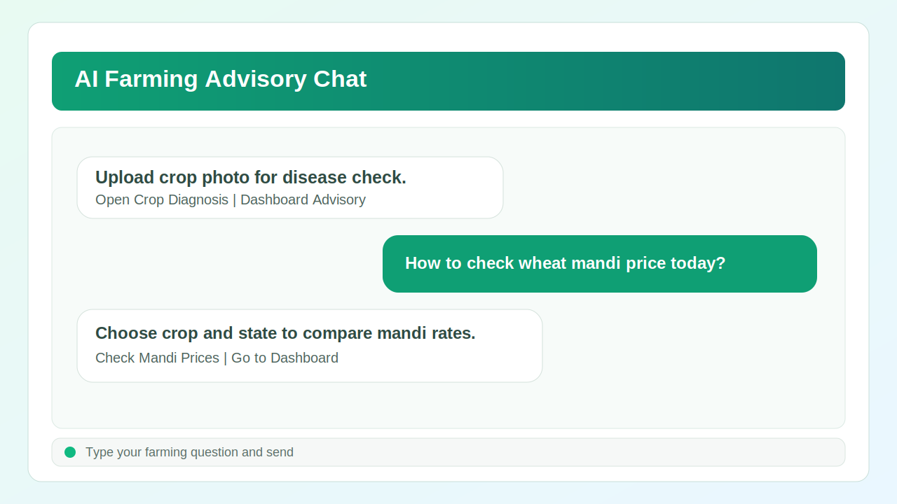
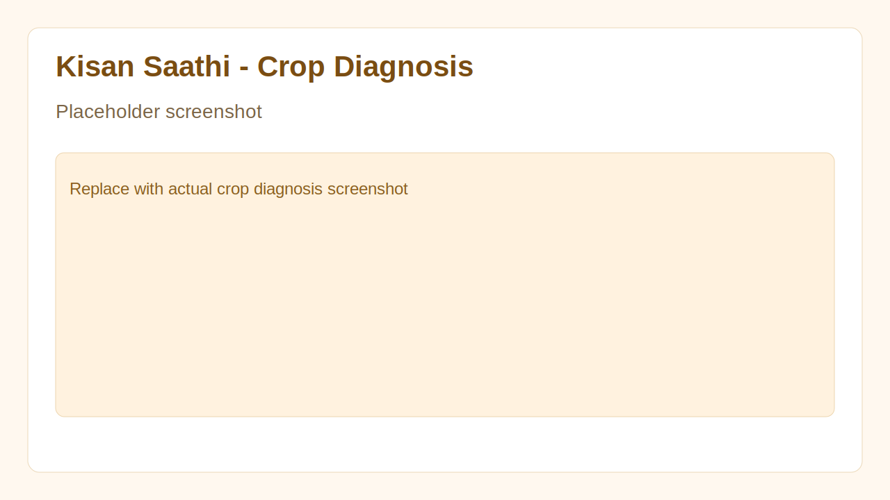
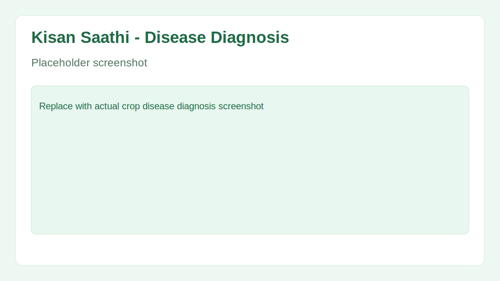
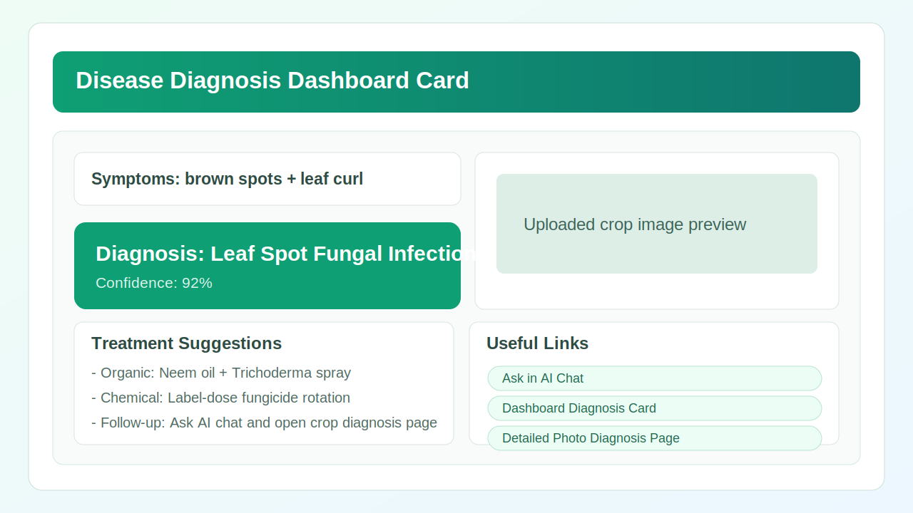
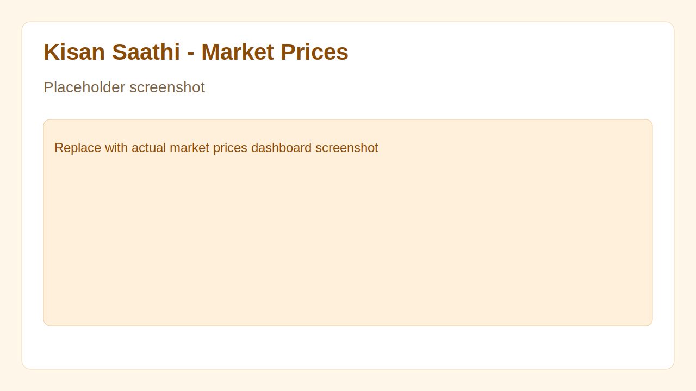
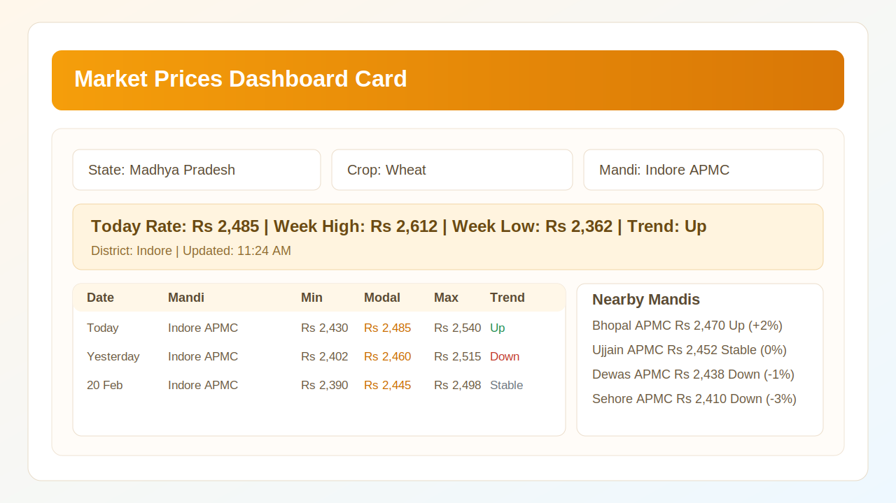
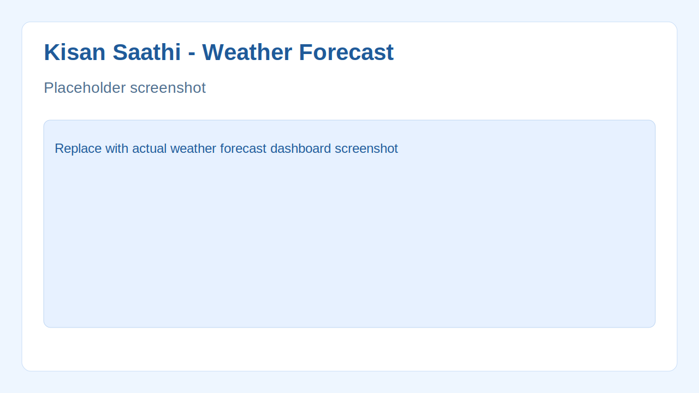
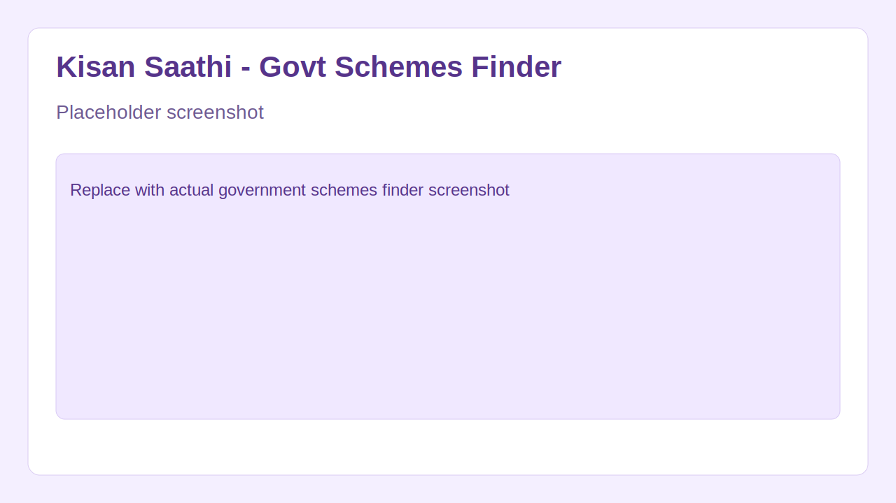
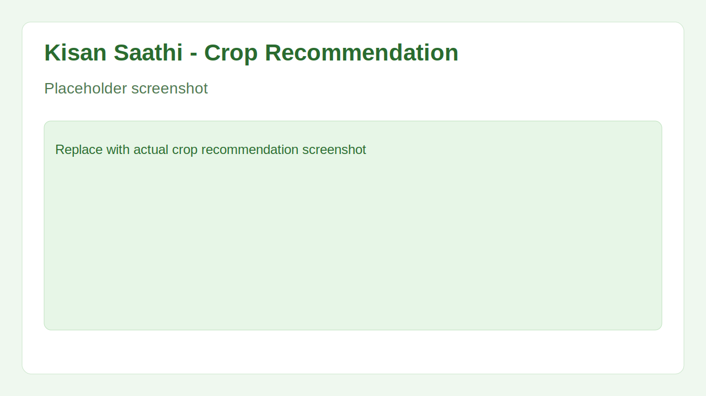
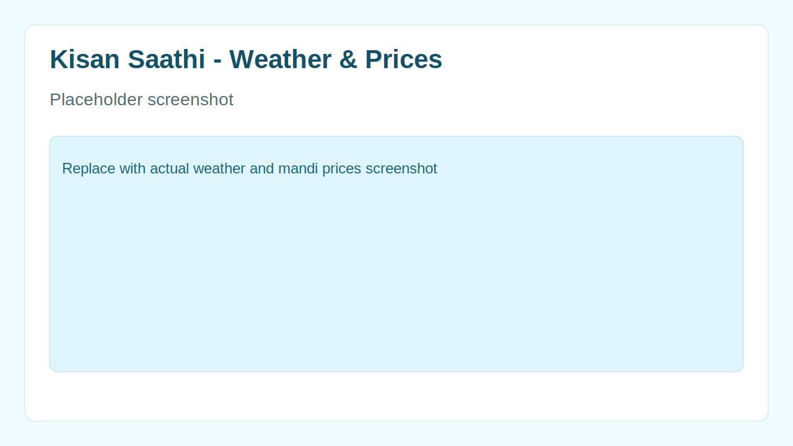

## Farmer Guides

- [Farmer Guide (English)](docs/farmer-guide.en.md)
- [किसान गाइड (Hindi)](docs/farmer-guide.hi.md)

## Contributing

Contributions are welcome.

1. Fork the repository.
2. Create a feature branch: `git checkout -b feature/your-change`.
3. Commit your changes: `git commit -m "Describe your change"`.
4. Push your branch and open a Pull Request.

Detailed guide: [CONTRIBUTING.md](CONTRIBUTING.md)

Before opening a PR, run:

```bash
npm run typecheck
npm run build
npm run test:e2e
```

## Production Readiness

Minimum launch checks:
1. Set production env:
   - `VITE_DATA_MODE=live`
   - `VITE_ALLOW_MOCK_FALLBACK=false`
   - Valid `VITE_API_BASE_URL`
   - Valid `VITE_MONITORING_ENDPOINT`
2. Run:
   - `npm run validate:env`
   - `npm run typecheck`
   - `npm run build`
   - `npm run test:e2e`
3. Confirm CI (`.github/workflows/ci.yml`) is green on `main`.

## Deployment Pipeline

Workflows:
- `.github/workflows/ci.yml`: PR/main quality gate
- `.github/workflows/deploy.yml`: staging and production deployments
- `.github/workflows/pages.yml`: GitHub Pages hosting deployment

Optional GitHub Actions setup (repo-level):
1. Add **Repository Variables**:
   - `VITE_APP_ID`
   - `VITE_API_BASE_URL`
   - `VITE_WHATSAPP_NUMBER`
   - `VITE_UPLOAD_ENDPOINT`
   - `VITE_MONITORING_ENDPOINT`
2. Add **Repository Secrets**:
   - `DEPLOY_HOOK_URL` (optional fallback hook for both staging and production)
   - Optional: `DEPLOY_HOOK_URL_STAGING` (overrides staging only)
   - Optional: `DEPLOY_HOOK_URL_PRODUCTION` (overrides production only)
   - Optional: `VITE_MONITORING_API_KEY`

Deployment triggers:
- Staging: automatic on push to `main`, or manual via `workflow_dispatch`
- Production: automatic on tag push `v*`, or manual via `workflow_dispatch`
- If no deploy hook URL is configured, workflow still passes and uploads `dist` as a GitHub Actions artifact.

Default behavior with no repo variables:
- `VITE_APP_ID`: `kisan-saathi-oss`
- `VITE_API_BASE_URL`: `https://example.invalid`
- `VITE_WHATSAPP_NUMBER`: `919876543210`
- `VITE_MONITORING_ENDPOINT`: `https://httpbin.org/post`

## GitHub Pages Hosting

To serve a public URL without external deploy hooks:
1. Repo `Settings` -> `Pages`
2. Source: `GitHub Actions`
3. Run workflow: `Deploy GitHub Pages` (or push to `main`)

Expected URL pattern:
- `https://<github-username>.github.io/kisan-saathi/`

Notes:
- Deep links (`/dashboard`, `/aihelp`) are supported using a generated `404.html` SPA fallback.
- Pages workflow uses mock data mode by default for stable public demo behavior.

## License

This project is licensed under the MIT License. See [LICENSE](LICENSE).

